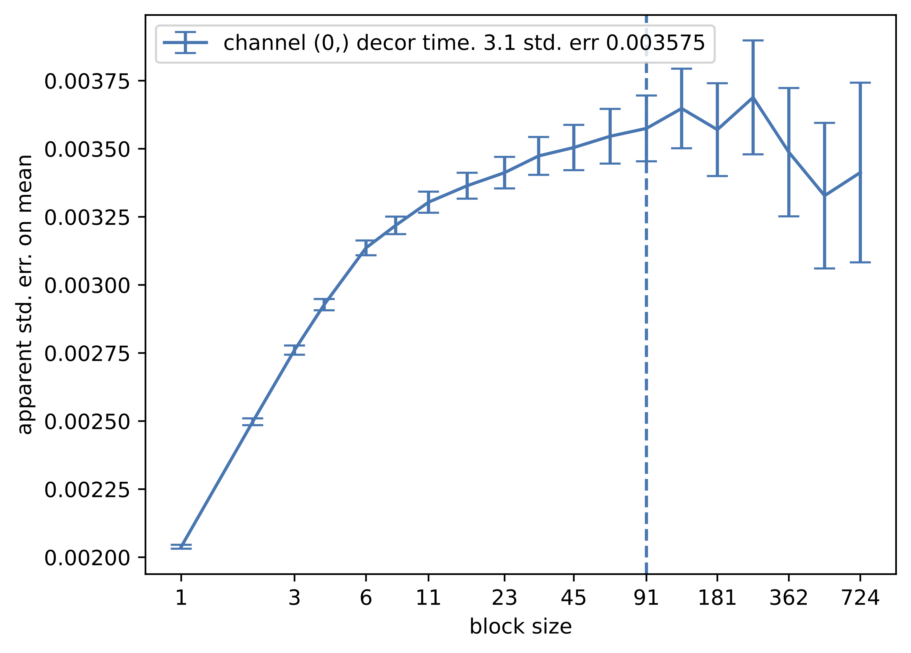

# `Hadrian`, successor of `atrajan`

`hadrian` is a refactoring of the `atrajan` (`a`tomic `traj`ectory `an`alysis) package.
Its main component is the `Hadrian` python class to calculate standard errors on the
means of **correlated** sequences of samples. Correlation is taken into account
by block averaging and monitoring the apparent error as a function of block
size.

The expected behavior when this is applied to a sufficiently long
trajectory of a constant plus noise is that the apparent standard error
is smallest for block size 1, because the number of independent samples
is overestimated by the naive number of samples. It then increases as the
block size increases, becoming independent of block size once it is larger
than a decorrelation time. Once the block size becomes large and number
of blocks becomes small, the apparent standard error becomes very noisy.
As a result, it is not trivial to detect this block-size independence regime.
An example of such a plot, automatically generated by this software is shown here


The optimal block size for defining the standard error is based on the heuristic from 
[R. M. Lee _et al._, Phys. Rev. B **83**, p. 066706 (2011)](https://doi.org/10.1103/PhysRevE.83.066706)
p. 7, last paragraph of col 1.  If this heuristic is not satisfied for any block size an
approximate unconverged result is reported from the worst case (largest error
over all block sizes).

If there is no plateau in the std. err vs. block size plot, it is
generally because the sampled quantity is not constant on the time scale
of the trajectory, or the trajectory is not long enough (typically tens of
times longer than the decorrelation time) to confirm convergence.  
In addition, oscillatory signals may produce large apparent standard error
for **small block size** that are currently identified (perhaps incorrectly)
as unconverged results, even if there is a well defined plateau in the plot
for larger block sizes.

## Usage

### command line

```
hadrianalyze [--plot_convergence_file conv.pdf] input_data
```

Analyze mean and std err of each channel, optionally plotting the convergence of the block averaging
process.  Results are written to stdout.

### python class

If the entire trajectory is available in `traj`:
```
h = Hadrian()

h.process_traj(traj)
channel_means, channel_std_errs, channel_decorrelation_times = h.means_and_std_errs(plot_file="decorrelation.pdf")
```

If the entire trajectory is not stored, the samples can be passed one at a time to `Hadrian.process_sample`
```
h = Hadrian()

for _ in range(n_steps):
    sample = some_func(cur_config)
    h.process_sample(sample)

channel_means, channel_std_errs, channel_decorrelation_times = h.means_and_std_errs(plot_file="decorrelation.pdf")
```
